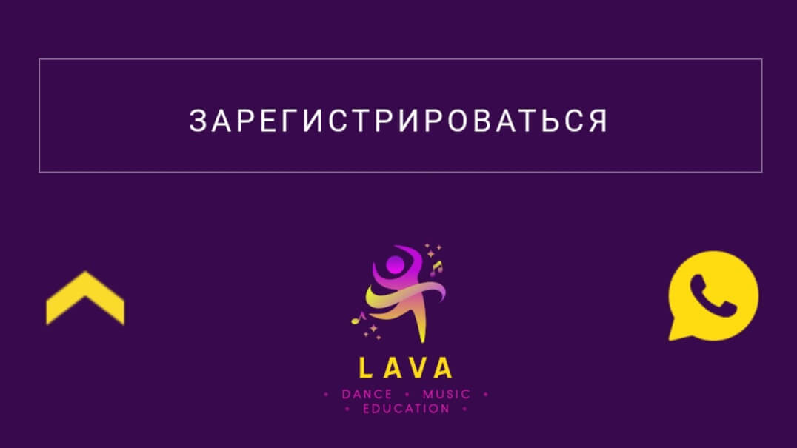

[Lava-Studio](https://xeni-ya.github.io/Lava-Studio/)

---

## Description

**A responsive and adaptive** landing page for a creative studio.

This is an educational project made by students of the #itgirlsschool.

## About the project

The site is implemented on Sass preprocessor. In the project were used the following technologies:

- Flexbox
- CSS Grid Layout
- Bootstrap

The project has animation for hovering the cursor over buttons

Also it has working navigation through page sections

For the convenience of users, a button for communication via whatsapp and an "up" button are implemented:

## To do

- [x] Modern design
- [x] Adaptive layout
- [x] Device formats: for phone to a greater extent+ for computer and tablet
- [x] Easy navigation and intuitive structure

## The project team

[AnnaSilverIT](https://github.com/AnnaSilverIT) - header and footer

[Xeni-ya](https://github.com/Xeni-ya) - page index.html and the "About the Studio” page, the "Certificates" page

[Glazunovatomara](https://github.com/Glazunovatomara) - the "Courses" page

[Elena Petukhova](https://github.com/ElenLen) - the "Schedule" page, the "Price List" page

[AlbinaBelaja](https://github.com/AlbinaBelaja) - the "Teachers" page and the "Rules" page

[Anastasiya](https://github.com/nastyaerma) - the “Gallery” page, the "Contacts” page

